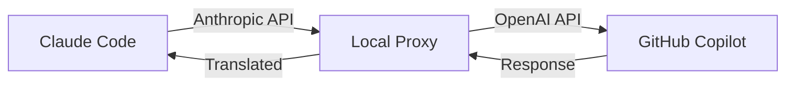

## What is Claude Code Copilot?

Claude Code Copilot is a lightweight local proxy that lets you **use Claude Code for free** by routing it through your existing GitHub Copilot subscription. No Anthropic API key required — just your Copilot subscription.

The proxy runs locally on your machine and translates between Anthropic's Messages API (which Claude Code speaks) and OpenAI's Chat Completions API (which GitHub Copilot speaks). All processing happens on your machine, and no data is stored or logged.

## How it works

The proxy acts as a transparent bridge between Claude Code and GitHub Copilot:

1. **Claude Code** sends requests in Anthropic's Messages API format
2. **Proxy** translates to OpenAI's Chat Completions format
3. **GitHub Copilot** processes the request
4. **Proxy** translates the response back to Anthropic format
5. **Claude Code** receives the response seamlessly

## Key features

<CardGroup cols={2}>
  <Card title="Full API translation" icon="arrows-rotate">
    Complete translation between Anthropic Messages API and OpenAI Chat Completions, including streaming responses and tool calls
  </Card>
  
  <Card title="Web search support" icon="globe">
    Emulates Anthropic's `web_search_20250305` tool using DuckDuckGo Lite (free) or Brave Search API for up-to-date information
  </Card>
  
  <Card title="Docker support" icon="docker">
    Run the proxy as an always-on container with `restart: always` that survives system reboots
  </Card>
  
  <Card title="Zero dependencies" icon="feather">
    Pure Node.js implementation with no npm packages to install — just clone and run
  </Card>
</CardGroup>

## What you'll need

Before getting started, make sure you have:

<CardGroup cols={2}>
  <Card title="GitHub Copilot" icon="github">
    An active Copilot subscription (Individual, Business, or Enterprise)
  </Card>
  
  <Card title="Node.js or Docker" icon="node">
    Node.js 18+ or Docker for running the proxy server
  </Card>
  
  <Card title="Claude Code" icon="terminal">
    Install with: `npm install -g @anthropic-ai/claude-code`
  </Card>
</CardGroup>

## Get started

<CardGroup cols={2}>
  <Card title="Quickstart" icon="rocket" href="/quickstart">
    Get up and running in under 5 minutes
  </Card>
  
  <Card title="Docker setup" icon="docker" href="/setup/docker">
    Run the proxy as a persistent Docker container
  </Card>
  
  <Card title="Configuration" icon="gear" href="/configuration/environment-variables">
    Customize ports, search providers, and more
  </Card>
  
  <Card title="Web search" icon="magnifying-glass" href="/usage/web-search">
    Enable web search with Brave or DuckDuckGo
  </Card>
</CardGroup>

## Why use this?

<AccordionGroup>
  <Accordion title="Save money on API costs">
    If you already have a GitHub Copilot subscription, you can use Claude Code without paying for an additional Anthropic API subscription. Perfect for developers who want to try Claude Code or use it occasionally.
  </Accordion>
  
  <Accordion title="Privacy-focused">
    The proxy runs entirely on your local machine. No data is sent to third-party services except GitHub Copilot (which you're already using). No logging, no tracking, no data storage.
  </Accordion>
  
  <Accordion title="Seamless integration">
    Once configured, Claude Code works exactly as if you were using the Anthropic API directly. All features including streaming, tool use, and web search are fully supported.
  </Accordion>
  
  <Accordion title="Open source">
    The entire codebase is open source and easy to audit. The proxy implementation is under 1400 lines of readable Node.js code with no external dependencies.
  </Accordion>
</AccordionGroup>

## Available models

The proxy supports all Claude models available through GitHub Copilot:

- **Claude Opus 4.6** — Most capable model for complex tasks
- **Claude Sonnet 4.5** — Balanced performance and speed  
- **Claude Sonnet 4** — Fast and capable for most tasks
- **Claude Opus 4.5** — Previous generation Opus
- **Claude Haiku 4.5** — Fastest model for simple tasks

<Tip>
Use the `/model` command inside Claude Code to switch between available models anytime.
</Tip>

## Next steps

Ready to get started? Follow the [quickstart guide](/quickstart) to authenticate and run Claude Code in under 5 minutes.
